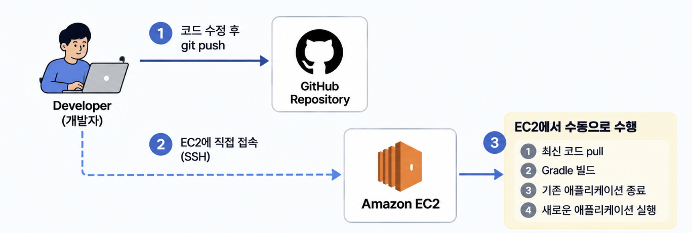
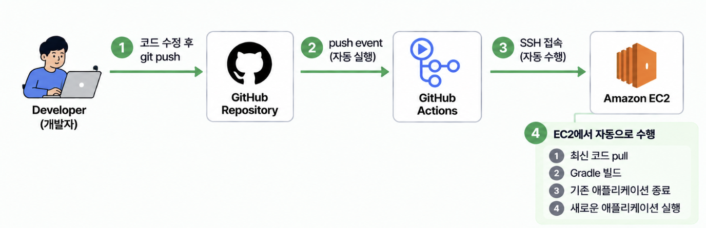

# CI/CD 실습 - 웹 애플리케이션의 수동 배포와 자동 배포

Spring Boot 웹 애플리케이션의 수동 배포와 GitHub Actions를 활용한 자동 배포를 직접 실습하고 비교하여 CI/CD가 필요한 이유와 GitHub Actions Workflow의 기본적인 동작 과정을 이해하기 위한 학습 프로젝트입니다.

## 1. 실습 내용

### 1-1. 실습 환경 구축

- Spring Boot를 이용하여 간단한 웹 애플리케이션 작성
- 웹 애플리케이션을 실행하기 위한 Amazon EC2 생성
- GitHub Repository의 코드를 EC2로 가져와 애플리케이션 빌드 및 실행

📌 [상세 실습 기록 - Spring Boot 웹 애플리케이션 환경 구축](https://blog.naver.com/siksikhanjapenlife/224429861315)

### 1-2. Spring Boot 웹 애플리케이션 수동 배포

- 웹 애플리케이션의 코드 변경
- 변경된 코드를 GitHub Repository에 Push
- EC2에서 변경된 코드를 직접 Pull
- Spring Boot 애플리케이션 수동 빌드 및 배포

📌 [상세 실습 기록 - Spring Boot 웹 애플리케이션 수동 배포](https://blog.naver.com/siksikhanjapenlife/224430972955)

### 1-3. GitHub Actions를 이용한 자동 배포

- GitHub Actions를 이용하여 CI/CD 파이프라인 구축
- GitHub Repository에 코드가 Push되면 Workflow 자동 실행
- GitHub Actions가 SSH를 통해 EC2에 접속
- EC2에서 변경된 코드를 Pull한 후 애플리케이션 자동 빌드 및 배포

📌 [상세 실습 기록 - GitHub Actions를 이용한 자동 배포](https://blog.naver.com/siksikhanjapenlife/224431219389)

## 2. 학습 목표

- 수동 배포와 자동 배포의 차이점 및 CI/CD가 필요한 이유
- GitHub Actions Workflow의 기본 구조와 동작 과정
- GitHub Actions를 이용한 Spring Boot 웹 애플리케이션의 빌드 및 배포 자동화

## 3. 아키텍처

### 3-1. 웹 애플리케이션 수동 배포

웹 애플리케이션의 코드를 수정한 후 개발자가 직접 EC2에 접속하여 애플리케이션을 빌드 및 배포

**개발자** : 코드 수정 → git push → EC2 SSH 접속 → git pull → build → deploy

### 3-2. GitHub Actions를 이용한 자동 배포

웹 애플리케이션의 코드를 수정한 후 GitHub에 Push하면 GitHub Actions가 실행되어 EC2에서 애플리케이션을 자동으로 빌드 및 배포

**개발자** : 코드 수정 → git push

**GitHub Actions** : EC2 SSH 접속 → git pull → build → deploy

## 4. 배운 점

- 애플리케이션 코드 변경 시 수동 배포와 자동 배포의 동작 차이
- GitHub Marketplace에서 제공되는 Action을 활용하는 방법
- GitHub Secrets를 이용한 민감한 정보의 관리
- GitHub Actions를 활용하여 EC2에 애플리케이션을 자동으로 배포하는 방법

## 5. 개선해야 할 점

- 애플리케이션 관련 파일이 변경된 경우에만 Workflow가 실행되도록 개선
- GitHub Actions Runner에서 애플리케이션 빌드 및 테스트 수행
- 빌드가 완료된 결과물만 EC2에 배포하도록 개선